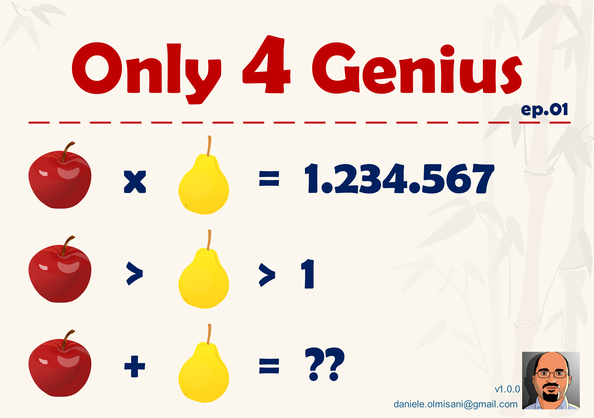
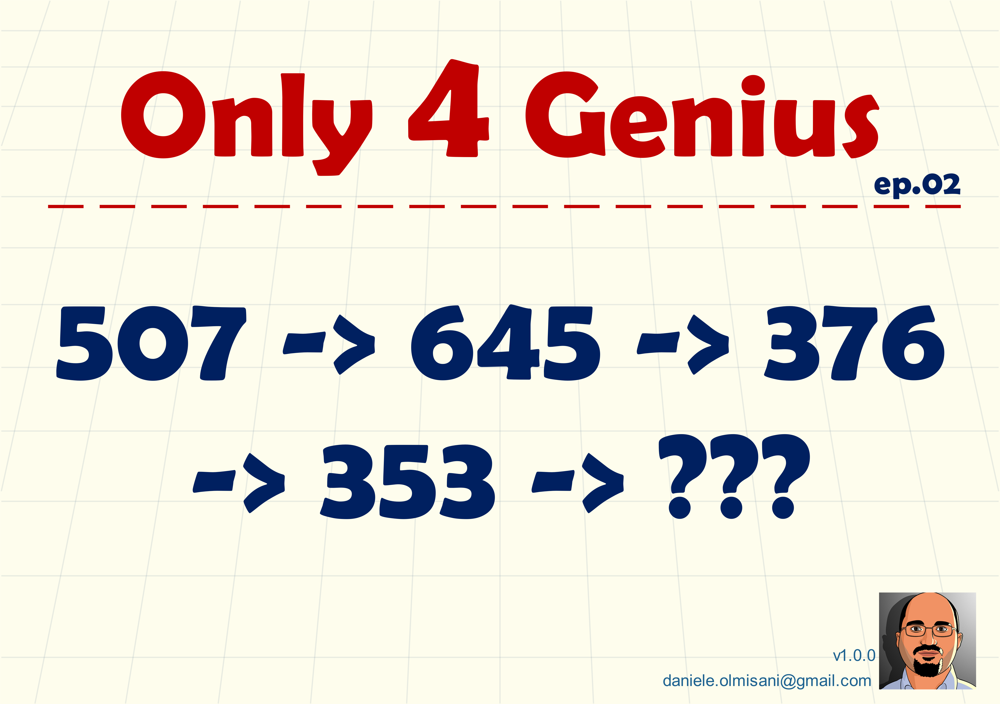

# Only for Genius

*Il 95% di voi non sarà capace di dare una risposta al seguente problema.*

Trovo molto spesso sul web (a dire il vero il più delle volte su Facebook) problemi pseudo-matematici che cercano di attirare click proponendo quesiti banali o che, al più, nascondono qualche ambiguità di notazione.
Se invece si tentasse di proporre un piccolo problema di facile comprensione, ma che pochi fossero capaci di risolvere?
Vediamo cosa sono riscito a fare.


## Episodio 01

### Il problema



### La soluzione

Si tratta di scomporre un numero in due fattori.
Tenendo conto dei soli numeri positivi, i valori cercati sono:

:pear: = 127

:apple: = 9721

Quindi la soluzione è **9.848**.

Il seguente programma è capace di scomporre il valore **N** in fattori primi:

```c++
#include <stdio.h>

int main() {
    int N = 1234567;
    for (int i=2; i<=N; i++) {
        while (N%i == 0) {
            printf("%d ", i);
            N /= i;
        }
    }
}
```

## Episodio 02

### Il problema

Si tratta di trovare il numero che, logicamente, sia la continuzione della sequenza.



### La soluzione
Il numero cercato è **363**.

Infatti le cifre di un numero in sequenza sono il conteggio delle lettere che descrivono la cifra corrispondente del numero che precede.
Esempio: **5 0 7** (cinque zero sette) -> **6 4 5**.

Da osservare che il numero tre e' l'unico punto fisso di questa trasformazione (i.e. F(3) = 3) e che tutte le cifre tenderanno a questo valore.
